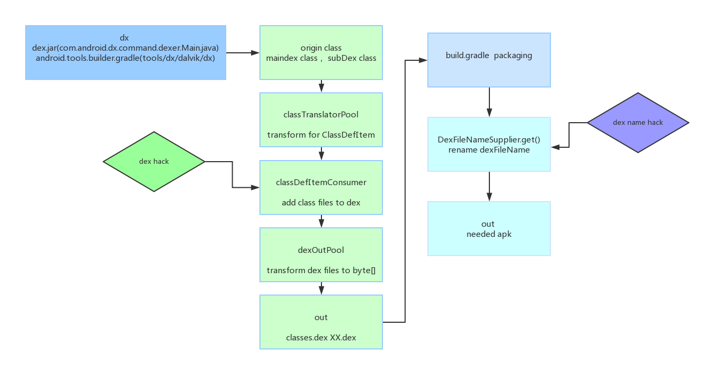

# DexSplitter Solution
As we all know, Google has provided aapt plugin for parsing apk, we can get a list of apk files by using 'aapt l -v '.
We can divide each res file(assets file) into the module project which it belongs to. 
But source code of the project can not be divided directly because it will be shrinked optimized and obfuscated.
DexSplitter can help you to divide source code.

[中文文档](/README_CHINESE.md)

# Scenarios
+	Analyze contribution rate of each module to the apk size 
+ 	Diff the size of each module in the apk for every sprint
	

# Apk Split Result

> ####  Android Origin Build Release.apk
> 
> ####  DexSplitter Build Release.apk
> 
> #### splitter_result.txt
> 

> ps:more details:extra/hack_description.txt extra/hook_details.txt 

# Demo Introduction
+	   The most important purpose of dexSplitter is to build apk which has special dex files
+	   You can use extra/dx.jar directly 
+	   Host app(lib:gson), library module moduleone(lib:GreenDAO), library module moduletwo(lib:universalimageloader)
+	   subdexeslist.txt is used for splitting dex, TestClassForMainDex.class is just a test file
+	   Third libs will not be obfuscated
+	   Android Support library is marked as android_sys
+	   subdexeslist.txt should not contain duplicated class files

# Schematic Diagram  
 

# Implementation

+	 Divide the dex files with class files
+    Build apk which has special dex files
+	 Python files for collecting class files 
+	 Obfuscated class list for release version

# Future
 
+	 Signed apk 
+	 Generate tables about the proportion of module projects
+	 Parse changes of dex files by comparing different apk versions
+	 Divide the dex files by author, module etc. 

# License
+ Copyright (c) 2018-present, iQIYI, Inc. All rights reserved.
Most source code in dexSplitter are MIT licensed. Some other source code have Apache licenses.
Please refer to the LICENSE file for detailed information.

	 

