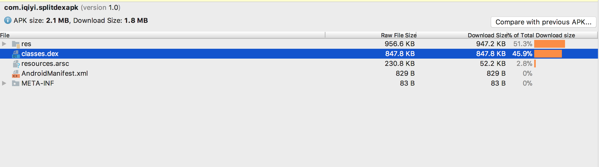
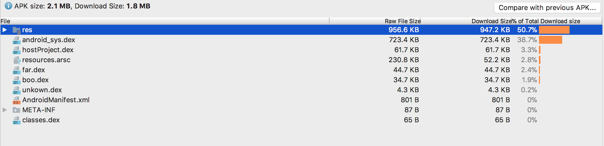
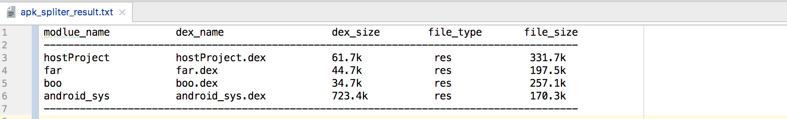
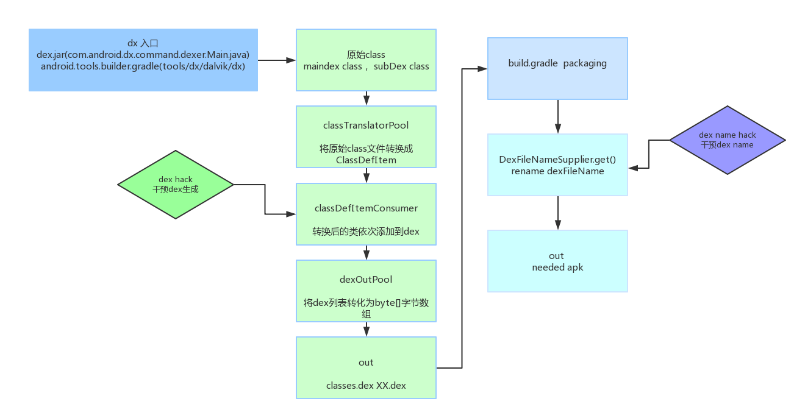

# 项目简介
为严控apk体积增长，需要精确量化apk中各模块占比大小。针对res文件、so文件（assets）等，Google提供了AAPT套件,通过脚本，可解压分析出各部分大小。
针对源码部分，混淆过的class文件，因经过合并，压缩等操作生成最终dex文件，无法直接分析各模块占比。
dexSplitter 主要针对源码部分，提供了一套彻底的分析APK dex组成的解决方案。

# 应用场景
 
+	 分析apk包体积各模块贡献率
+ 	 跟踪版本迭代时，包体积各部分变动量，及变化趋势
+	 详细监控各模块内各子模块占比情况
	

# Android原生Apk组成
 
+	 apk中dex部分，无法衡量各业务占比情况

> ####  正常生成的apk组成
>

# dexSplitter方案生成Apk
+	 apk中dex部分，可以精确测算各业务占比，辅以python脚本可得出各业务总体占比情况

> ####  最终Apk
> 
> #### 分析结果
> 

> ps:more details:extra/hack_description.txt

# Demo 示例说明:
+	   dexSpliter工程，打包生成带有dex分组属性的apk，可认为dex分拆方案已完成。附带的python apk分析脚本，简单划分了module资源文件，仅供参考。
+	   extra/dx.jar 为编译好的dx文件，可用来替换系统dx.jar
+	   主工程app(示例lib 为gson)，library module moduleone（示例lib为GreenDAO），library module moduletwo( 示例lib为universalimageloader)
+	   实际分组文件为subdexeslist.txt, maindexlist.txt为系统必须文件，无实质内容，增加的测试文件TestClassForMainDex.class(用来绕过系统检查)
+	   为便于对比验证，第三方库未参与混淆
+	   dex占比划分中，Android Support库作为独立库(android_sys)示例，单独划分
+	   未明确划分的代码，会被打进unkown.dex
+	   subdexeslist.txt为真实apk包含的最终class,不应出现重复类，否则会导致打包错误

# hack的基本原理示意图
 

+	   dx.jar编译源码地址：    https://android.googlesource.com/platform/dalvik demo基于26.0.2
+	   android gradle源码地址：https://android.googlesource.com/platform/tools/base  
+	   干预dex生成过程，按需生成dex文件，并对其按模块命名。com.android.dx.command.dexer.Main.java 
+	   干预gradle插件packaging阶段重命名过程，使其保持模块命名。com.android.builder.internal.packaging.DexIncrementalRenameManager.java

# SplitDexAPK已支持的功能:

+	 支持class粒度级别拆分各业务模块源码；
+    支持按需输出apk文件，源码部分占比可直接展示
+	 可定制化脚本，自动收集生成各模块源码文件
+	 支持Release版本，混淆文件分拆分拣
+	 可按工程模块，业务模块等各种维度进行占比分析

# 实际应用:

+	 持续监控IQIYI客户端多个版本apk体积变化，详细分解了如泡泡，基线，播放器，支付模块等业务模块，按照代码与资源相对apk整体贡献比每月出具量化报告。 
     为科学量化与严格监控客户端包体积变化提供了有效数据支撑。

# 后续扩展
 
+	 demo仅做演示，未增加签名处理，可通过签名文件处理，得到最终版本apk文件
+	 结合aapt分析res,assets目录文件等，可得出综合模块apk贡献率统计表
+	 脚本部署后，可定期跟踪包体积各部分变动量，及变化趋势
+	 可结合git提交记录等，按业务模块，提交作者，工程模块等各种维度进行占比分析

# License
+ 
Copyright (c) 2018-present, 爱奇艺, Inc. All rights reserved.
dexSplitter中大多数的源码使用 MIT 许可证，另外的一些源码使用 Apache 样式的许可证。
详细信息请查看 LICENSE 文件。

	 

